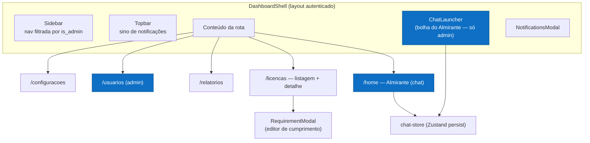
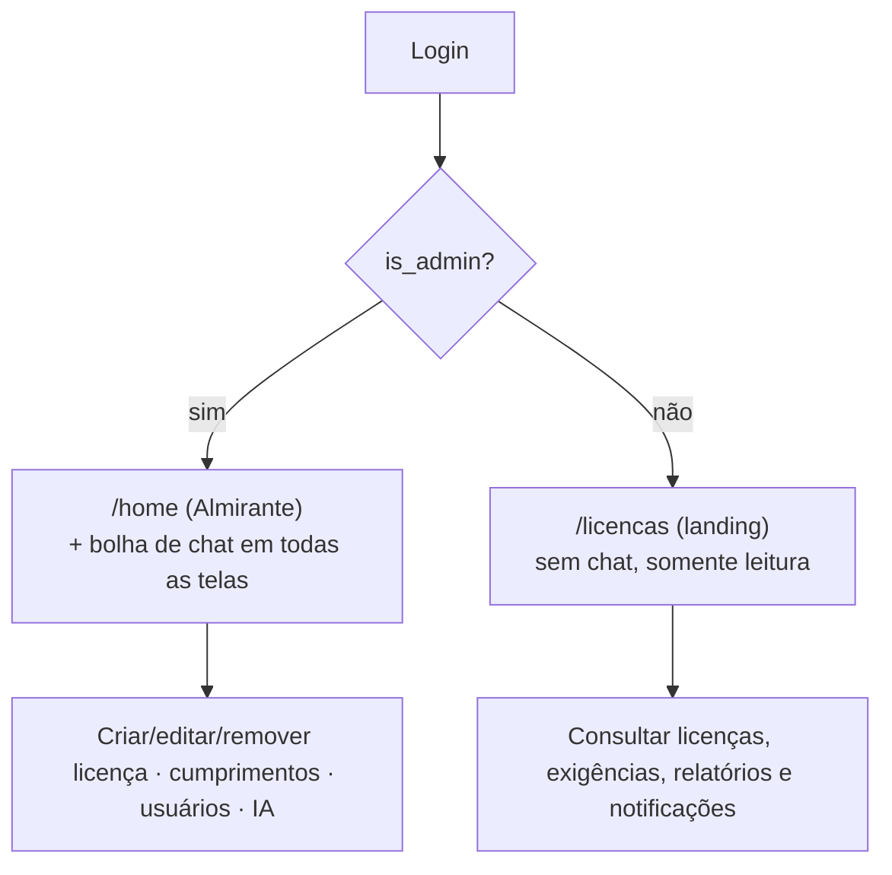
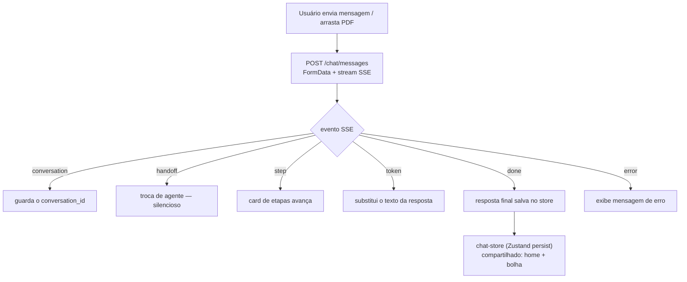
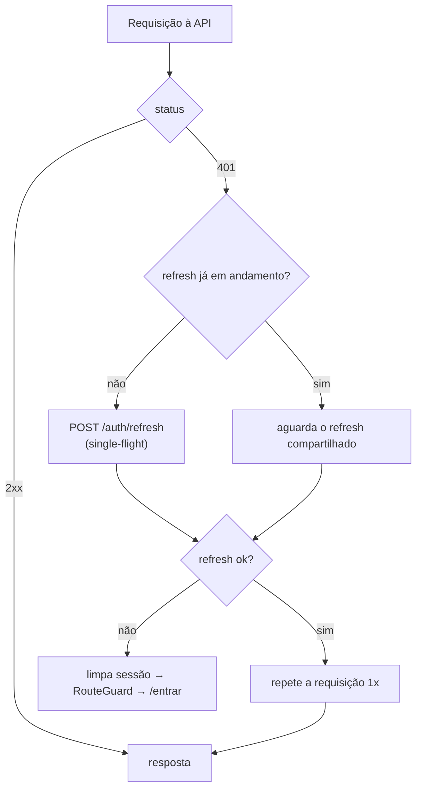

# Suape Digital — Frontend

Dashboard web do sistema de **licenciamento ambiental do Porto de Suape** e do
assistente de IA **Almirante**. Aqui o time da SUAPE consulta licenças e
exigências, registra o cumprimento das condicionantes (SEI, prazos, área
responsável, evidências), acompanha vencimentos e conversa com o Almirante —
que lê PDFs de licença e extrai as exigências automaticamente.

Construído em **Next.js 16 (App Router) + React 19 + TypeScript**, com **Zustand**
para estado, **CSS Modules** para estilo e **streaming SSE** no chat.

---

## Sumário

- [Stack](#stack)
- [Arquitetura da aplicação](#arquitetura-da-aplicação)
- [Níveis de acesso](#níveis-de-acesso)
- [Features](#features)
- [Rotas](#rotas)
- [Gerência de estado (Zustand)](#gerência-de-estado-zustand)
- [Integração com a API](#integração-com-a-api)
- [Como rodar](#como-rodar)
- [Build & deploy](#build--deploy)

---

## Stack

| Camada | Tecnologia |
|---|---|
| Framework | **Next.js 16** (App Router, `output: standalone`) |
| UI | **React 19**, TypeScript |
| Estado | **Zustand 5** (com `persist` + `skipHydration`) |
| Estilo | **Tailwind CSS 4** + **CSS Modules** + design tokens (cores da marca SUAPE: `#0e6fc4` / `#f4ae38`) |
| Markdown | `react-markdown` + `remark-gfm` (respostas do chat) |
| Ícones | `@phosphor-icons/react` |
| Sessão | cookies **httpOnly** + `js-cookie`; refresh automático no client central |
| Tempo real | **SSE** (`fetch` + `ReadableStream`) para o chat |
| Build/deploy | Docker (standalone) → **GHCR** → VPS atrás de **nginx + certbot** |

---

## Arquitetura da aplicação

Organização por **features** (vertical slices): cada feature tem seus
`components`, `api`, `types`, `stores` e `hooks`. O `AuthProvider` (layout raiz)
inicializa a sessão via `GET /auth/me`; o `RouteGuard` (layout autenticado)
redireciona quem não está logado para `/entrar`. O layout autenticado é o
`DashboardShell` (sidebar + topbar + conteúdo), com o **Almirante** flutuante e o
modal de notificações montados por cima.



```
src/
├── app/
│   ├── (public)/entrar/          # login
│   └── (auth)/                    # protegido pelo DashboardShell
│       ├── home/                  # Almirante (chat) — admin
│       ├── licencas/ + [id]/      # listagem + detalhe
│       ├── relatorios/  usuarios/  configuracoes/
├── components/layout/             # DashboardShell, Sidebar, Topbar, nav-config
├── lib/                           # api-client (refresh single-flight), routes (landingPathFor)
└── features/
    ├── auth/          # sessão (useSessionStore), AuthProvider, RouteGuard, LoginForm
    ├── chat/          # Almirante: container, composer, SSE, store, steps
    ├── licenses/      # listagem, detalhe, RequirementModal, purge
    ├── notifications/ # sino, modal, polling
    ├── audit/         # timeline de auditoria
    └── users/         # gestão de usuários (admin): form, reset de senha, exclusão
```

---

## Níveis de acesso

O acesso é definido pela flag **`is_admin`** do usuário (de `useSessionStore`).
A navegação do sidebar é filtrada por `adminOnly`, e o destino inicial vem de
`landingPathFor(isAdmin)`.



| Recurso | Admin | Usuário comum |
|---|:---:|:---:|
| Almirante (chat `/home` + bolha flutuante) | ✅ | ❌ |
| Consultar licenças / exigências / documentos / auditoria | ✅ | ✅ (leitura) |
| Registrar/editar **cumprimento** (status, SEI, área, prazos, evidência) | ✅ | ❌ |
| Anexar / remover arquivos | ✅ | ❌ |
| **Remover licença** (purge) | ✅ | ❌ |
| Gestão de **usuários** (`/usuarios`) | ✅ | ❌ |
| Relatórios, notificações, configurações | ✅ | ✅ |

> Usuários não-admin que tentam abrir `/home` são redirecionados para o destino
> de `landingPathFor` (Licenças). A bolha do Almirante (`ChatLauncher`) só é
> montada para admins. As ações de escrita batem em endpoints `require_admin` no
> backend (defesa em profundidade).

---

## Features

### Almirante (chat) — `features/chat`

Assistente de IA com **streaming SSE** e **markdown**.

- **Dois pontos de entrada, mesma conversa:** o chat da tela inicial (`/home`) e a
  **bolha flutuante** compartilham o estado via um **store Zustand com `persist`**
  (`skipHydration`) — trocar de tela não perde o histórico.
- **Streaming:** o cliente consome o SSE e **substitui** o texto a cada `token`
  (não concatena), evitando repetição. Só a **resposta coerente do especialista**
  é exibida — a conversa interna entre supervisor/agentes não vaza.
- **Card de etapas (stepper):** durante o processamento de um PDF, um card mostra
  as bolinhas avançando (ex.: "Lendo o PDF e extraindo as exigências",
  "Indexando no RAG", "Revisão do agente"), alimentado pelos eventos `step`.
- **Drag-and-drop:** arrastar um arquivo em **qualquer lugar da tela** mostra o
  overlay tracejado "Solte os arquivos para anexar" (detecção a nível de `window`).



### Licenças — `features/licenses`

- **Listagem** com filtros e status, e **detalhe** (`/licencas/[id]`) em abas:
  **Informações · Exigências · Documentos · Auditoria**.
- **`RequirementModal`** (editor de cumprimento): situação, prazos (interno/CPRH),
  peso, **Nº SEI**, **Área responsável (SUAPE)** num **combobox filtrável** (≥3
  letras, busca por nome ou sigla, via `GET /internal-clients`), evidência e
  anexos. Para exigências **recorrentes**, gerencia **uma ocorrência por vez**.
- **Remover licença:** botão **admin-only** no topo do detalhe → modal de
  confirmação (ação irreversível) → `DELETE /licenses/{id}` (purge completo:
  exigências, cumprimentos, RAG, anexos, auditoria, notificações) → volta à
  listagem.

### Notificações — `features/notifications`

- **Sino** na topbar com contador de não lidas + **modal** com a lista; **polling**
  periódico do `GET /notifications` (não há push web ainda). Marcar como lida
  chama `PATCH /notifications/{id}/read`. Deep-link pela `resource` (abre a
  licença/exigência).

### Auditoria — `features/audit`

- **Timeline** por licença (`GET /licenses/{id}/audit`): quem fez o quê e quando
  (registro de licença, SEI adicionado, cumprimento atualizado, notificação lida…).

---

## Rotas

| Rota | Conteúdo | Acesso |
|---|---|---|
| `/entrar` | Login | público |
| `/home` | Almirante (chat) | **admin** |
| `/licencas` | Listagem de licenças | autenticado |
| `/licencas/[id]` | Detalhe (abas) + cumprimentos + purge | autenticado (escrita = admin) |
| `/relatorios` | Relatórios | autenticado |
| `/usuarios` | Gestão de usuários | **admin** |
| `/configuracoes` | Configurações | autenticado |

---

## Gerência de estado (Zustand)

- **`useSessionStore`** (auth): usuário logado + `is_admin`; base do controle de
  acesso e de `landingPathFor`.
- **`chat-store`** (`persist` + `skipHydration`): mensagens, `isStreaming`,
  `steps`, compartilhado entre o chat da home e a bolha. O `partialize` evita
  persistir estados efêmeros (`isStreaming`, previews). A hidratação é manual
  (`skipHydration`) para evitar mismatch de SSR.
- **`notifications-store`**: estado do modal/sino.

---

## Integração com a API

- Base URL via **`NEXT_PUBLIC_API_URL`** (default `http://localhost:8000`).
- **Client central** (`lib/api-client.ts`): todas as requisições com
  `credentials: 'include'` (cookies httpOnly automáticos); em `401` faz **refresh
  single-flight** (`POST /auth/refresh` compartilhado entre chamadas concorrentes)
  e repete a requisição uma vez — se falhar, dispara o handler que limpa a sessão.
- Cada feature tem seu `api/client.ts` (wrapper `apiFetch`, `ApiError`, `204 → null`).
- **Chat:** consumo de **SSE** (`fetch` + leitura do stream) tratando os eventos
  `conversation` / `handoff` / `step` / `token` / `done` / `error`.
- Funções principais: `fetchLicenses`, `fetchLicenseById`, `deleteLicense`
  (purge), `fetchRequirements`, `fetchFulfillments`, `upsertFulfillment`,
  `fetchInternalClients`, `fetchLicenseFiles` / `uploadRequirementFile` /
  `deleteFile`, `fetchNotifications` / `markNotificationAsRead`.



---

## Como rodar

Pré-requisitos: Node 20+ e o backend rodando (ver README do backend).

```bash
cp .env.example .env.local     # defina NEXT_PUBLIC_API_URL
npm install
npm run dev                    # http://localhost:3000
```

Scripts: `npm run dev` · `npm run build` · `npm run start` · `npm run lint`.

---

## Build & deploy

- **Build standalone** (`output: standalone`): `npm run build` gera
  `.next/standalone` com `server.js` + deps mínimas, ideal para Docker.
- **Entrega pull-based:** GitHub Actions builda e publica a imagem no **GHCR**; a
  VPS puxa via systemd timer e sobe atrás de **nginx + certbot**
  (`almirante.chat`). O healthcheck do container aponta para `/entrar`.
